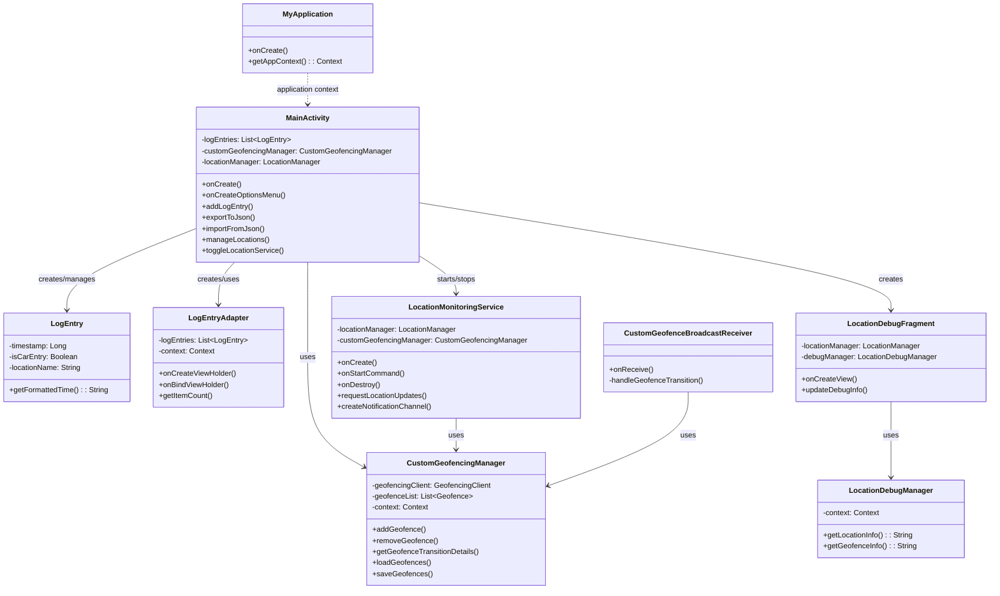
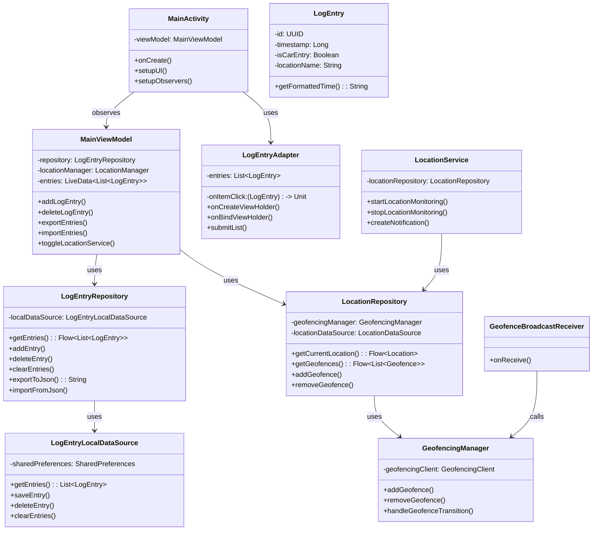

# Koylel App Class Diagram

## Current Architecture

## Proposed Architecture (MVVM)

The proposed architecture follows MVVM principles with clear separation of concerns:

1. **View Layer**: Activities and Fragments that observe ViewModels
2. **ViewModel Layer**: Holds UI state and business logic
3. **Repository Layer**: Single source of truth for data
4. **Data Sources**: Local and remote data providers

This structure improves testability, maintainability, and follows Android architecture best practices. 